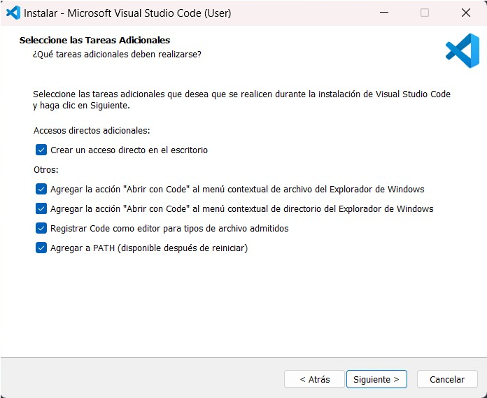
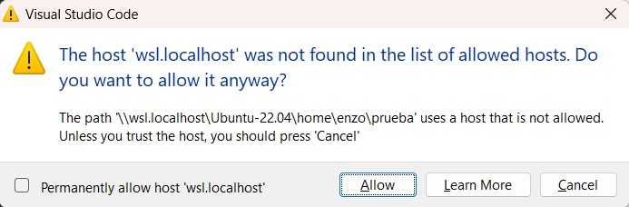
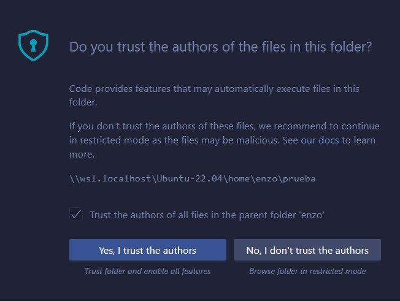

## Introducción

Tuve la idea de crear esta serie de posts debido a que estuve en proceso de cambiar de computador. Por lo que, tuve que instalar desde cero todos los programas que necesitaré. En parte estoy creando esta serie como una guía personal que me pueda ser útil en más de alguna ocasión. Pero, creo que también puede ser una buena oportunidad para ayudar a otras personas en su proceso de instalación de ciertos programas. Y cómo una guía de distintos programas y tecnologías que les puedan servir.

Esta guía se basará en un *setup* para un computador con sistema operativo *Windows* y que utilizará *Windows Subsystem Linux* (**WSL**). Esta es la configuración que personalmente prefiero, ya que pasar de un sistema operativo a otro se vuelve más cómodo. Además, en mi caso particular el computador al que me cambio no cuenta con demasiada memoria (476GB) como para que, a mi criterio, resulte positivo realizar una [partición en el disco](https://en.wikipedia.org/wiki/Disk_partitioning). 

Como usuario siempre he utilizado Windows como sistema operativo, por lo que estoy muy acostumbrado a su uso. También, al ser el principal sistema operativo para usuarios, según [Statista](https://es.statista.com/estadisticas/634540/sistemas-operativos-para-pc-cuota-de-mercado-mundial/); tiene como consecuencia que los programas sean compatibles con él la mayoría de veces. Siendo principalmente notorio respecto a videojuegos, que es un aspecto importante para mi. 

El uso que hago del sistema operativo *Linux* es exclusivamente para programar, utilizándolo desde una terminal (o *shell*). La razón es que Linux ofrece una gran facilidad y soporte para el desarrollo, en particular gracias a la facilidad de instalación de programas y manejo de versiones a través de su terminal. Para ver más beneficios del uso de Linux, recomiendo el siguiente post: [Why Linux Reigns Supreme: A 20-Year Programmer's Perspective](https://www.linkedin.com/pulse/why-linux-reigns-supreme-20-year-programmers-sam-paniagua/). 

Si bien, las tareas de programación me interesa realizarlas desde Linux, hay algunos programas que pueden resultar prácticos de tener también en Windows. Por ejemplo, un editor de código cómo *VSCode* para poder inspeccionar ciertos archivos que sean descargados desde el navegador. También, hay ciertos programas que están directa o indirectamente relacionados a las tareas de programación y que dada su interfaz es preferible acceder desde Windows y no mediante la terminal en Linux. 

Son todos estos aspectos, sumado a una lista considerable de programas, me motivaron a crear esta guía de setup. A continuación, daré una contextualización de los distintos programas e indicaré una forma de instalación a partir de su documentación. 

La guía está separada en distintas categorías de programas, por un lado, están los programas que considero que son esenciales y transversales para el desarrollo en este setup en particular. Y, por otro lado, están los programas que si bien son relevantes dependerá de las necesidades o intereses que se tengan. También, nombraré algunos programas que pueden ser instalados en Windows de forma convencional y que pueden llegar a ser un aporte en distintos ámbitos. 


## Programas Esenciales

### Windows Terminal. 
*Windows Terminal*, es una aplicación de terminal (o Shell) de comandos que permite trabajar con distintos perfiles. Estos perfiles pueden ser personalizados con distintos tipos de terminales diferentes. Este será el primer programa que instale ya que me facilitará pasar de una terminal de Windows como *PowerShell* o *Git Bash*, a una en Linux como *Bash*. También, una particularidad que tiene es que gráficamente es muy personalizable y estéticamente logra ser mucho más agradable que las terminales por defecto. Este programa puede ser instalado desde la [Microsoft Store](https://www.microsoft.com/store/productId/9N0DX20HK701?ocid=pdpshare). 

### Windows Subsystem for Linux
*Windows Subsystem for Linux* o [WSL](https://wiki.ubuntu.com/WSL) es un software desarrollado por Windows que permite ejecutar un sistema operativo Linux en Windows. En particular, WSL2 mediante una maquina virtual efectivamente ejecuta un sistema operativo Linux completo, a diferencia de WSL 1 que  utiliza una interfaz que adapta las llamadas al sistema, [syscalls](https://www.linfo.org/system_call.html), de Linux a Windows; [WSL Compare Versions](https://learn.microsoft.com/en-us/windows/wsl/compare-versions). Es posible instalarlo, con la versión 2 por defecto, directamente desde la [Microsoft Store](https://www.microsoft.com/store/productId/9P9TQF7MRM4R?ocid=pdpshare). También, se instalará una versión de la distribución de Linux, *Ubuntu*, por defecto. Preferiblemente, instalaremos otra versión o distribución de Linux que preferamos. En particular, yo utilizaré la versión más reciente **LTS** (*Long Term Support*) de Ubuntu disponible en Microsoft Store, ya que como su nombre indica tiene un soporte prolongado y por lo tanto, está mejor cubierto ante posibles problemas que puedan surgir, [Ubuntu 22.04.3 LTS](https://www.microsoft.com/store/productId/9PN20MSR04DW?ocid=pdpshare). Una vez terminados estos pasos, será posible configurar un nuevo perfil para la versión de Ubuntu que escogimos en Windows Terminal y poder utilizarla. Cuando entremos por primera vez a esa terminal con Linux, nos pedirá configurar nuestro usuario. 

Ubuntu viene con una herramienta para el manejo de paquetes y dependencias llamada [APT](https://ubuntu.com/server/docs/package-management) (*Advanced Packaging Tool*). Esta herramienta lleva un registro de referencias a los repositorios de los paquetes, facilitando el proceso de instalación y de actualización. Los principales comandos que utilizaremos son los siguientes:

- Para instalar un paquete y sus dependencias: 

```bash
sudo apt install
```

- Para actualizar las referencias de los repositorios:

```bash
sudo apt update
```

- Para aplicar cambios y actualizaciones en los paquetes: 

```bash
sudo apt upgrade
```

Para estos comandos siempre anteponemos el comando *sudo* (*Super User Do*), este nos permite ejecutar el comando a continuación con los privilegios del usuario *Root*;  [Understanding the difference between Sudo and Root in Linux](https://medium.com/@cyberduck1/understanding-the-difference-between-sudo-and-root-in-linux-528c84e9b43d). Esto es necesario debido a que para poder instalar o actualizar los paquetes, es necesario que APT interactúe con el sistema de archivos.


Para manejar archivos dentro de Linux utilizo la propia terminal, sin embargo, para poder intercambiar archivos entre Windows y Linux desde la terminal de Linux puede ser útil llamar al [Explorador de Archivos de Windows](https://learn.microsoft.com/en-us/windows/wsl/filesystems#view-your-current-directory-in-windows-file-explorer) en la ubicación de la terminal de WSL. Esto lo podemos hacer con el siguiente comando, indicando el directorio actual: 

```bash
explorer.exe .
```


### Visual Studio Code
*Visual Studio Code* es un editor de código, este tiene la gran ventaja de ser compatible para distintos sistemas operativos. Así como contar con múltiples herramientas en forma de extensiones creadas por la comunidad. Son estas extensiones creadas tanto por Microsoft como por la comunidad de desarrolladores que le dan un gran potencial al editor. Para realizar la instalación, descargaremos el instalador de la versión estable de [VSCode](https://code.visualstudio.com/) para Windows. Si bien, utilizamos el instalador para Windows, VSCode es compatible con WSL por lo que no es necesario hacer una instalación adicional. Durante el proceso de instalación deberemos configurar algunas opciones, para poder utilizar todas las características recomiendo completarlas siguiendo estos pasos:

Primero deberemos indicar de qué formas queremos acceder a VSCode. Por un lado, agregaremos las opciones de abrir VSCode a partir de un archivo o directorio desde el menú contextual. Por otro lado, definiremos VSCode como el editor predeterminado. Y, agregaremos VSCode a PATH para poder ejecutarlo desde la terminal. Para aplicar este cambio deberemos reiniciar el computador.



Luego, si llamamos a code desde la terminal de WSL nos solicitará autorizar el *host*. Así que, lo autorizaremos de forma permanente, rellenando la casilla respectiva.



Una vez abierto indicaremos que la carpeta de nuestro usuario es confiable para habilitar todas las características. Por lo que, seleccionaremos que confiamos en los autores de los archivos dentro de la carpeta padre de nuestro usuario en WSL.



Una vez instalado, podremos acceder al editor en Windows desde el acceso directo o como una de las opciones del menú contextual al hacer click derecho. Para acceder desde Linux, podemos ejecutar el siguiente comando para abrir el editor en el directorio actual ó alternativamente indicando una ruta:

```bash
code .
```

Las [extensiones](https://marketplace.visualstudio.com/VSCode) de VSCode se pueden agregar fácilmente dentro de la misma aplicación. Algunas extensiones, funcionales y no estéticas, que suelo utilizar son: 

1. [Live Server](https://marketplace.visualstudio.com/items?itemName=ritwickdey.LiveServer); para poder levantar rápidamente un servidor que ejecute un sitio web estático desde el editor, y poder visualizarlo en el navegador. Permite evitar problemas comunes al abrir archivos de un sitio web estático directamente desde el navegador.
2. [Jupyter](https://marketplace.visualstudio.com/items?itemName=ms-toolsai.jupyter); permite visualizar y editar el contenido de un *Jupyter Notebook* desde una interfaz similar a la original.
3. [VSCode-PDF](https://marketplace.visualstudio.com/items?itemName=tomoki1207.pdf); permite visualizar documentos en formato PDF directamente desde editor.
4. [GitHub Copilot](https://marketplace.visualstudio.com/items?itemName=GitHub.copilot); permite generar autocompletado en tiempo real de nuestro código. Siendo una inteligencia artificial creada por *GitHub*. Es importante siempre revisar y tener cuidado con el código generado; es una herramienta útil que nos permite ser más eficientes, pero puede generar varios errores en nuestro código.

Adicionalmente, se pueden agregar múltiples extensiones que permiten trabajar más fácilmente con la sintaxis de los distintos lenguajes de programación. Así como, [Linters](https://www.linkedin.com/advice/1/why-should-you-use-linter-your-code-skills-application-development-exyhf#%C2%BFqu%C3%A9-es-un-linter?) que son herramientas que cuidan tanto la sintaxis como el formato o estilo con el cual se está trabajando.


### Git y Git Credential Manager
*Git* es un sistema de control de versiones que permite poder manejar tanto de manera individual como colaborativa la forma en que se va modificando el estado de un proyecto. Es una de las herramientas más fundamentales actualmente para poder desarrollar un proyecto de cualquier tamaño y complejidad. Para instalarlo desde Windows podemos descargar el instalador desde la [página web](https://git-scm.com/downloads). Recomiendo buscar una guía específica de instalación ya que el proceso tiene muchas opciones de configuración y es importante revisarlas bien en detalle. 

En el caso de Windows se instalará una terminal adicional basada en Bash, esta terminal se llama *Git Bash*. A partir de ahora, para Windows recomiendo principalmente trabajar desde esta terminal; ya que al estar basada en Bash respeta el estándar [POSIX](https://pubs.opengroup.org/onlinepubs/9699919799.2018edition/). Para Linux podemos instalarlo utilizando APT, en este caso deberemos actualizar la referencia al repositorio para poder obtener las versiones más recientes:

```bash
sudo add-apt-repository ppa:git-core/ppa
sudo apt update
sudo apt install git
```


Para poder realizar commits deberemos configurar nuestro nombre y correo bajo el cuál quedarán registrados. Podemos realizarlo mediante los siguientes comandos:

```bash
git config --global user.name "John Doe"
git config --global user.email johndoe@example.com
```

Podemos instalar [Github CLI](https://docs.github.com/en/get-started/getting-started-with-git/caching-your-github-credentials-in-git?platform=linux#github-cli) para almacenar nuestras credenciales de forma automática, evitando tener que almacenar y copiar manualmente algún token de acceso cada vez que realizacemos alguna operación en Git. Para instalar Github CLI utilizamos APT:

```bash
sudo apt install gh
```

Luego, lo configuramos con el comando:

```bash
gh auth login
```

Debemos seleccionar como protocolo preferido para Git HTTPS e indicar Y(es) para autenticar Git con nuestras credenciales de GitHub.

### Docker
*Docker* es una plataforma que permite ejecutar software de forma aislada mediante virtualización de forma ligera, esto posibilita independizar el código de la infraestructura o el hardware sobre el cual está corriendo. En consecuencia, logra que un proyecto con ciertas dependencias se ejecute de la misma forma para dos computadores diferentes, evitando conflictos de instalación de dependencias y compatibilidad. Lo principal para trabajar con Docker es instalar el [Docker Engine](https://docs.docker.com/engine/) sobre el cual se ejecuta la funcionalidad principal, y los paquetes adicionales. Entre ellos Docker Compose que permite orquestar la ejecución de múltiples ‘aplicaciones’ o, concretamente, *contenedores* a la vez. A continuación se muestran los pasos de instalación para Ubuntu, utilizando APT, basado en la [documentación](https://docs.docker.com/engine/install/ubuntu/#install-using-the-repository):

> Add Docker's official GPG key:
```bash
sudo apt update
sudo apt install ca-certificates curl gnupg
sudo install -m 0755 -d /etc/apt/keyrings
curl -fsSL https://download.docker.com/linux/ubuntu/gpg | sudo gpg --dearmor -o /etc/apt/keyrings/docker.gpg
sudo chmod a+r /etc/apt/keyrings/docker.gpg
```

> Add the repository to Apt sources:
```bash
echo \
  "deb [arch=$(dpkg --print-architecture) signed-by=/etc/apt/keyrings/docker.gpg] https://download.docker.com/linux/ubuntu \
  $(. /etc/os-release && echo "$VERSION_CODENAME") stable" | \
  sudo tee /etc/apt/sources.list.d/docker.list > /dev/null
sudo apt update
```

> Install the Docker packages:
```bash
sudo apt install docker-ce docker-ce-cli containerd.io docker-buildx-plugin docker-compose-plugin
```


Un paso adicional que podemos hacer es agregar nuestro usuario de Linux al grupo Docker, esto permite ejecutar los comandos de Docker sin la necesidad de otorgarle privilegios de usuario root, o llamar a sudo (*Super User Do*). Sin embargo, esto puede llegar a ser un riesgo respecto a la seguridad. Debido a que eventualmente usuarios no root podrían acceder a los mismos privilegios que un usuario root. Por ejemplo, accediendo a todo el sistema de archivos; en el siguiente post se puede ver un ejemplo de esto: [User privileges in Docker containers](https://medium.com/jobteaser-dev-team/docker-user-best-practices-a8d2ca5205f4). Por lo tanto, hay que tener especial cuidado cuando manejamos un entorno de desarrollo con múltiples usuarios, que debiesen tener diferentes niveles de privilegio. Siendo esto muy relevante cuando trabajamos en un servidor que se encuentra en producción, y existen múltiples personas con distintos niveles de acceso. En el caso de esta guía, al tratarse de la instalación para un entorno de desarrollo personal puede no implicar un mayor riesgo. En este caso, se recomienda siempre tener cuidado con las imágenes que se ejecutan en Docker. Los pasos según la [documentación](https://docs.docker.com/engine/install/linux-postinstall/) para poder agregar nuestro usuario al grupo Docker son los siguientes:

> To create the docker group and add your user:
```bash
sudo groupadd docker 
sudo usermod -aG docker $USER 
newgrp docker
```

En la documentación de Docker se puede profundizar en el aspecto de la seguridad y posibles vulnerabilidades: [Docker security](https://docs.docker.com/engine/security/). En la siguiente guía pueden encontrar buenas prácticas y recomendaciones, bastante avanzadas, respecto a seguridad en el uso de Docker: [An Overview of Docker Security Essentials](https://www.linode.com/docs/guides/docker-security-essentials/).


## Programas Relevantes

###	Python y Jupyter
*Python* es el segundo lenguaje de programación más popular en los repositorios de Github, detrás de JavaScript; [GitHub Octoverse](https://github.blog/2023-11-08-the-state-of-open-source-and-ai/#the-most-popular-programming-languages). Es especialmente utilizado debido a la facilidad de su sintaxis. Al ser un lenguaje donde existe un tipado, pero este se maneja de forma dinámica. También, es un lenguaje interpretado, en que el intérprete de Python ejecuta los programas en tiempo real. A diferencia de los lenguajes compilados, donde se generan ejecutables en forma de binarios. Estas características, le dan una gran flexibilidad al lenguaje; motivando su gran adopción. 

Otro factor relevante es la cantidad de librerías que se crean sobre este lenguaje. En particular, Python se ha vuelto muy relevante para la ciencia de datos y la inteligencia artificial. Es en este último punto donde aparece [Jupyter Notebook](https://jupyter.org) como una interfaz gráfica en forma de aplicación web. Además, de contar con un flujo de trabajo por medio de celdas de ejecución que permiten ‘recordar’ lo anteriormente ejecutado. Son estas características que lo vuelven una herramienta muy práctica en este ámbito. Por último, existen muchas librerías específicas que permiten potenciar su funcionalidad gráfica. 

Para instalar Python, utilizaremos APT:

```bash
sudo apt install python3
```

Una vez tengamos Python, utilizaremos el instalador de paquetes de Python [pip](https://pypi.org/project/pip/) (*Package Installer for Python*) para poder instalar Jupyter. Lo podemos instalar con el siguiente comando:

```bash
sudo apt install python3-pip 
```

Hasta el momento me he referido siempre como *Jupyter Notebook* que es el nombre más conocido de la interfaz, pero actualmente está disponible *Jupyter Lab* que utiliza esta interfaz como base y ofrece un entorno de desarrollo más completo. Para instalarlo usamos el comando:

```bash
pip install jupyterlab 
```

Por último, una alternativa a Jupyter Notebook es [Google Colab](https://colab.google/), que es un servicio de Jupyter Notebook hosteado por Google. Este otorga la ventaja de no necesitar de un equipo demasiado potente para poder ejecutar operaciones complicadas o costosas, por ejemplo, entrenamiento de redes neuronales. Ya que, es posible asignar diferentes unidades de procesamiento específicas como CPU, GPU o TPU.


###	Node, NVM, NPM y Yarn
*NodeJS* es un entorno de ejecución asíncrono basado en eventos, que permite correr JavaScript fuera de un navegador. Siendo capaz de aceptar múltiples conexiones de forma concurrente. Esto permite construir aplicaciones de forma escalable; [Introduction to Node.js](https://nodejs.org/en/learn/getting-started/introduction-to-nodejs). 

Dadas sus características su principal uso se encuentra del lado del servidor o backend de una aplicación. Sin embargo, con la ayuda de gestores de paquetes como [NPM](https://www.npmjs.com/) (*Node Package Manager*) o [Yarn](https://classic.yarnpkg.com), permite también extender su uso para el uso de clientes en el frontend de una aplicación. 

Adicionalmente, debido al uso extendido de diversos paquetes y librerías en el desarrollo, se vuelve necesario contar con un correcto manejo de versiones. Considerando, por un lado, la misma versión de Node surge la herramienta de [NVM](https://github.com/nvm-sh/nvm/blob/master/README.md) (*Node Version Manager*) para poder manejar distintas versiones en nuestro equipo. Por otro lado, en el caso de las dependencias del proyecto utilizamos los mismo manejadores de paquetes como NPM y Yarn.

Según la [documentación](https://docs.npmjs.com/downloading-and-installing-node-js-and-npm) de NPM al utilizar NVM para instalar Node, también, se instalará de forma automática una versión de NPM compatible con la versión de Node. 

Para la instalación, descargaremos y ejecutaremos el script de instalación de NVM desde su repositorio; [Install & Update Script](https://github.com/nvm-sh/nvm/blob/master/README.md#install--update-script):

```bash
curl -o- https://raw.githubusercontent.com/nvm-sh/nvm/v0.39.7/install.sh | bash
```

Podemos instalar la última versión de Node con el comando:

```bash
nvm install node 
```
 
Alternativamente, podemos indicar la versión de Node que queremos instalar, por ejemplo:

```bash
nvm install 14.7.0 
```

Por último, según la [documentación](https://classic.yarnpkg.com/en/docs/install) de Yarn, podemos utilizar NPM para instalarlo con el siguiente comando: 

```bash
npm install --global yarn 
```

###	PostgreSQL
*PostgreSQL* es una base de datos relacional *OpenSource*. Siendo también la base de datos más popular actualmente, por sobre MySQL o SQLite, según la [Developer Survey](https://survey.stackoverflow.co/2023/#section-most-popular-technologies-databases) de Stack Overflow.  

Al ser una base de datos OpenSource tan popular y contar con muchos años de existencia, posee un amplio apoyo por parte de la comunidad. Reflejado en distintos proyectos que buscan poder implementar esta base de datos junto a distintos stacks tecnológicos. Por ejemplo, [Sequelize](https://sequelize.org/) como ORM (*Object Relational Mapping*) es compatible con PostgreSQL. Un ORM nos permite abstraer la lógica de negocio en nuestro proyecto, para que luego este se comunique con la base de datos para poder reflejar los cambios. 

Para instalar utilizaremos APT:

```bash
sudo apt install postgresql
```


###	Amazon Web Services CLI
*Amazon Web Services* o [AWS](https://aws.amazon.com/es/what-is-aws/) es uno de los proveedores más importantes de servicios Cloud actualmente, sirviendo el 32% de la infraestructura a nivel mundial a finales de 2022; según [Statista](https://www.statista.com/statistics/967365/worldwide-cloud-infrastructure-services-market-share-vendor/). Posee una plataforma muy completa a la vez que compleja, lo que supone un proceso de aprendizaje importante para poder sacar el mayor rendimiento de esta. 

[AWS CLI](https://aws.amazon.com/es/cli/) (*AWS Command Line Interface*) es una herramienta que nos permite interactuar con los servicios de AWS desde nuestra terminal. La cual se vuelve necesaria para poder realizar ciertas operaciones en particular, o para poder facilitar algunas que pueden ser realizadas desde la misma consola de AWS; desde la aplicación web. 

Para poder instalarlo recomiendo revisar los pasos de la [documentación](https://docs.aws.amazon.com/cli/latest/userguide/getting-started-install.html) para linux, ya que los pasos cambian dependiendo de la arquitectura de nuestros computadores. 


###	Valgrind
[Valgrind](https://valgrind.org/info/) es una herramienta útil para poder debuggear errores de memoria en programas en C o derivados. Ofrece información lo más detallada posible haciendo un seguimiento de la secuencia de llamados de funciones y variables, para poder identificar la fuente del error. Indicando si existe, por ejemplo, una determinada cantidad de memoria sin liberar. 

Podemos instalar Valgrind mediante APT:

```bash
sudo apt install valgrind
```


###	Fish
[Fish](https://fishshell.com/) es una shell o terminal específica que posee por defecto algunas características que facilitan el uso de comandos. Entre ellas, autocompletado, resaltado de comandos bien escritos, historial de comandos más práctico y un diccionario de descripción de comandos.  Otras terminales como *Zsh* ofrecen una gran capacidad de personalización, pero requieren de configurar manualmente todas esas características. 

Una desventaja para tener en consideración es que Fish no es compatible con POSIX, ya que utiliza su propia sintaxis. Para poder solucionar esto, al momento de crear un script dentro de un archivo, es posible agregar al comienzo del archivo una línea para indicar el intérprete con el que debe ser ejecutado el script, pudiendo ser para bash:

```bash
#!/bin/bash
```

Alternativamente, podemos indicar el intérprete como SH que es [una versión predecesora](https://tecadmin.net/difference-between-sh-and-bash/) de Bash:

```sh
#!/bin/sh 
```

Podemos instalar Fish por medio de APT:

```bash
sudo apt install fish
```


 Por defecto, al abrir la terminal seguiremos usando bash y cuando queramos utilizar fish ejecutamos el comando fish, y para volver a bash usamos exit.


### Commando Line Text Editors
Esta es una categoría de editores de código, que permiten mostrar una interfaz de edición dentro de la terminal. Existen varias opciones, entre ellas una muy conocida y con gran capacidad de personalización y configuración es [NeoVim](https://neovim.io/). 

En mi caso prefiero no instalar ningún editor de texto en la terminal debido a que me acomoda más utilizar VSCode como editor principal. Además, en caso de conexiones remotas por [SSH](https://www.cloudflare.com/es-es/learning/access-management/what-is-ssh/) al no estar instalado por defecto en el servidor remoto; debería utilizar, en un principio, [Nano](https://help.ubuntu.com/community/Nano) o [Vim](https://www.vim.org/about.php) de todas formas. 

## Programas Secundarios
Estos programas poseen instaladores para Windows. Su uso es más bien circunstancial y depende de las preferencias y necesidades que posean. Por ejemplo, programas de grabación y edición de video; estadísticos; de organización; autorización/autenticación; de comunicación; creación de prototipos; entre otros.

-	[DBeaver](https://dbeaver.io/)
-	[Discord](https://discord.com)
-	[Figma](https://www.figma.com/)
- [Gimp](https://www.gimp.org/)
-	[Kdenlive](https://kdenlive.org/)
-	[Notion](https://www.notion.so/)
-	[OBS Studio](https://obsproject.com/)
-	[Postman](https://www.postman.com/)
-	[R Studio](https://posit.co/products/open-source/rstudio/)
-	[Slack](https://slack.com)
-	[Telegram](https://telegram.org/)
-	[Wireshark](https://www.wireshark.org/)
-	[Zoom](https://zoom.us/)


